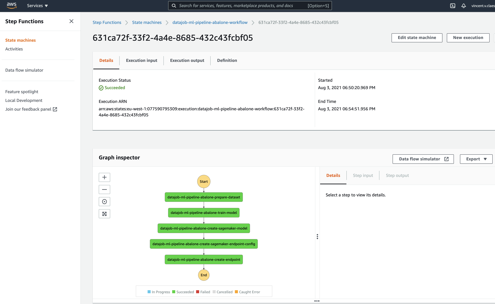
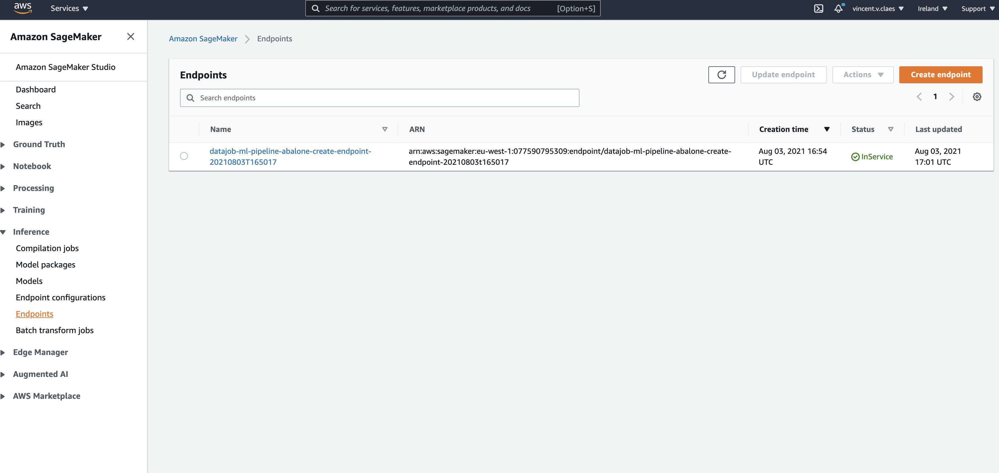

# End to End Machine Learning Pipeline

> This example is an implementation of datajob of [an official aws sagemaker example.](https://github.com/aws/amazon-sagemaker-examples/blob/master/step-functions-data-science-sdk/machine_learning_workflow_abalone/machine_learning_workflow_abalone.ipynb)

We want to predict the age of abalone (sea snails) from their physical measurements using XG Boost algorithm.

We will setup an ML pipeline that prepares the abalone datatset, launches a training step and deploys the model behind a sagemaker endpoint.

we have 5 steps in our ML pipeline:

- **prepare_dataset_step**: this task is a glue job that splits a dataset into train, validation, and test datasets. It then uploads the datasets to the sagemaker default bucket.
- **training_step**: train a ml model using XG Boost.
- **model_step**: get the model from the training step and create a sagemaker model.
- **endpoint_config_step**: create a configuration for deploying the sagemaker model behind an endpoint.
- **endpoint_step**: create a sagemaker endpoint using the endpoint_config_step

## Deploy

    cd examples/ml_pipeline_end_to_end
    export AWS_PROFILE=my-profile
    export AWS_DEFAULT_REGION=eu-west-1
    cdk deploy --app "python datajob_stack.py" --require-approval never

             ✅  datajob-ml-pipeline-abalone

            Outputs:
            datajob-ml-pipeline-abalone.DatajobExecutionInput = ["datajob-ml-pipeline-abalone-train-model", "datajob-ml-pipeline-abalone-create-sagemaker-model", "datajob-ml-pipeline-abalone-create-sagemaker-endpoint-config", "datajob-ml-pipeline-abalone-create-endpoint"]

            Stack ARN:
            arn:aws:cloudformation:eu-west-1:077590795309:stack/datajob-ml-pipeline-abalone/e179ec30-f45a-11eb-9731-02575f1b7adf

execute the ml pipeline

    datajob execute --state-machine datajob-ml-pipeline-abalone-workflow

            [18:50:18] execution input found:
                       {'datajob-ml-pipeline-abalone-train-model': 'datajob-ml-pipeline-abalone-train-model-20210803T165017',
                       'datajob-ml-pipeline-abalone-create-sagemaker-model': 'datajob-ml-pipeline-abalone-create-sagemaker-mo-20210803T165017',
                       'datajob-ml-pipeline-abalone-create-sagemaker-endpoint-config': 'datajob-ml-pipeline-abalone-create-sagemaker-en-20210803T165017',
                       'datajob-ml-pipeline-abalone-create-endpoint': 'datajob-ml-pipeline-abalone-create-endpoint-20210803T165017'}
                       executing: datajob-ml-pipeline-abalone-workflow
            [18:50:19] status: RUNNING
                       view the execution on the AWS console:

            https://console.aws.amazon.com/states/home?region=eu-west-1#/executions/details/arn:aws:states:eu-west-1:077590795309:execution:datajob-ml-pipeline-abalone-workflow:631ca72f-33f2-4a4e-8685-432c43fcbf05

If you click the link, you can follow up on the progress

In the end a sagemaker endpoint is created:

In our example the name of the endpoint is `datajob-ml-pipeline-abalone-create-endpoint-20210803T165017`
Pull down the sagemaker endpoint by executing the following command:

    aws sagemaker delete-endpoint --endpoint-name datajob-ml-pipeline-abalone-create-endpoint-20210803T165017
